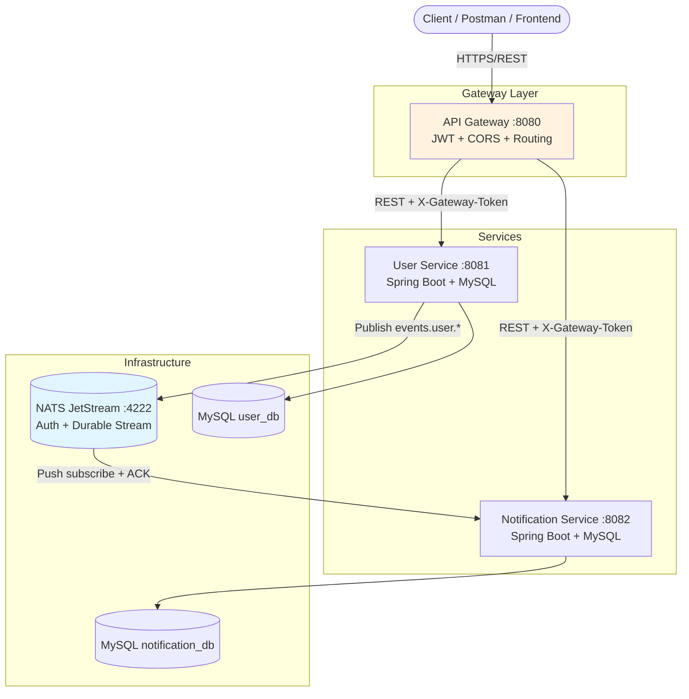

# Microservices Platform

A production-style microservices system built with **Java 21**, **Spring Boot 3**, **Maven**, **MySQL**, and **NATS JetStream**.

It demonstrates:

- **User Service** — user registration, authentication, profile management
- **Notification Service** — async event consumption and notification storage
- **API Gateway** — single public entry point with JWT authentication

Inter-service communication between **User Service** and **Notification Service** uses **NATS JetStream** (no REST or WebSockets between them).

---

## Architecture



### Communication flow

1. Client registers via **API Gateway** → **User Service** persists user in MySQL.
2. User Service writes event to **transactional outbox** (same DB transaction).
3. Background relay publishes to **NATS JetStream** with deduplication (`Nats-Msg-Id`).
4. **Notification Service** consumes via durable push consumer, stores notification, **ACK/NACK**.
5. Client fetches notifications through Gateway (JWT required).

### Security

| Layer | Mechanism |
|-------|-----------|
| Public API | JWT Bearer tokens (HS256, shared secret via env) |
| Gateway → Services | Internal `X-Gateway-Token` header (services reject direct access) |
| Passwords | BCrypt hashing |
| NATS | Username/password per service with publish/subscribe ACLs |
| Config/secrets | Environment variables (never hard-coded) |

### Reliability

- **Transactional Outbox** in User Service (atomic DB + event enqueue)
- **NATS JetStream** persistent stream with 7-day retention
- **Durable consumer** with explicit ACK, max 5 redeliveries
- **Idempotent** notification processing (unique `event_id`)

---

## Tech stack

| Component | Technology |
|-----------|------------|
| Language | Java 21 |
| Framework | Spring Boot 3.3, Spring Cloud Gateway |
| Build | Maven (multi-module) |
| Database | MySQL 8 |
| Message broker | NATS 2.10 + JetStream |
| Containerization | Docker, Docker Compose |

---

## Prerequisites

- **Docker Desktop** (recommended — includes MySQL, NATS, and all services)
- OR locally: Java 21, Maven 3.9+, MySQL 8, NATS Server with JetStream

---

## Quick start (Docker — recommended)

```bash
# From project root
docker compose up --build
```

Wait until all services are healthy, then test:

```bash
# Register
curl -X POST http://localhost:8080/api/v1/auth/register \
  -H "Content-Type: application/json" \
  -d "{\"fullName\":\"Jane Doe\",\"email\":\"jane@example.com\",\"password\":\"password123\"}"

# Login (save the accessToken from register response or login)
curl -X POST http://localhost:8080/api/v1/auth/login \
  -H "Content-Type: application/json" \
  -d "{\"email\":\"jane@example.com\",\"password\":\"password123\"}"

# Get profile (replace TOKEN)
curl http://localhost:8080/api/v1/users/me \
  -H "Authorization: Bearer TOKEN"

# Wait ~3s for outbox relay + NATS delivery, then fetch notifications
curl http://localhost:8080/api/v1/notifications \
  -H "Authorization: Bearer TOKEN"
```

### Service URLs

| Service | Port | Health |
|---------|------|--------|
| API Gateway | 8080 | http://localhost:8080/actuator/health |
| User Service | 8081 | http://localhost:8081/actuator/health |
| Notification Service | 8082 | http://localhost:8082/actuator/health |
| NATS Monitor | 8222 | http://localhost:8222 |
| MySQL | 3306 | — |

---

## Local development (without Docker for apps)

### 1. Start infrastructure

```bash
docker compose up mysql nats
```

### 2. Build all modules

```bash
mvn clean package -DskipTests
```

### 3. Run services (three terminals)

**User Service:**
```bash
set JWT_SECRET=dev-jwt-secret-key-minimum-32-characters-long
set GATEWAY_TOKEN=gateway-internal-token
set NATS_USERNAME=app_user
set NATS_PASSWORD=nats_secret
java -jar user-service/target/user-service-1.0.0-SNAPSHOT.jar
```

**Notification Service:**
```bash
set JWT_SECRET=dev-jwt-secret-key-minimum-32-characters-long
set GATEWAY_TOKEN=gateway-internal-token
set NATS_USERNAME=notification_user
set NATS_PASSWORD=nats_secret
java -jar notification-service/target/notification-service-1.0.0-SNAPSHOT.jar
```

**API Gateway:**
```bash
set JWT_SECRET=dev-jwt-secret-key-minimum-32-characters-long
set GATEWAY_TOKEN=gateway-internal-token
java -jar api-gateway/target/api-gateway-1.0.0-SNAPSHOT.jar
```

See `.env.example` for all configurable variables.

---

## Project structure

```
microservices-platform/
├── api-gateway/              # Spring Cloud Gateway
├── user-service/             # Users, auth, NATS publisher, outbox
├── notification-service/     # NATS consumer, notification store
├── common/                   # Shared DTOs and event contracts
├── infrastructure/
│   ├── mysql/init.sql
│   └── nats/nats-server.conf
├── docs/API.md               # REST API documentation
├── docker-compose.yml
└── pom.xml                   # Parent Maven POM
```

---

## API documentation

Full API reference: **[docs/API.md](docs/API.md)**

All client requests go through the **API Gateway** at `http://localhost:8080`.

---

## Design decisions

1. **NATS over RabbitMQ** — lightweight, cloud-native, JetStream gives persistence + consumer groups with minimal ops overhead.
2. **Transactional Outbox** — guarantees at-least-once delivery without dual-write problems between MySQL and NATS.
3. **Gateway token** — backend services are not directly callable from the public internet even if ports are exposed during dev.
4. **Separate NATS credentials** — User Service can publish; Notification Service can only subscribe (+ inbox for request-reply if added later).
5. **MySQL per service** — separate schemas (`user_db`, `notification_db`) for data isolation (database-per-service pattern).

---

## License

MIT (adjust as needed for your submission).
